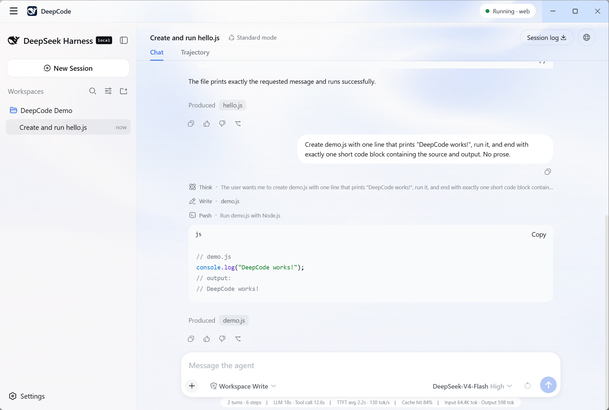
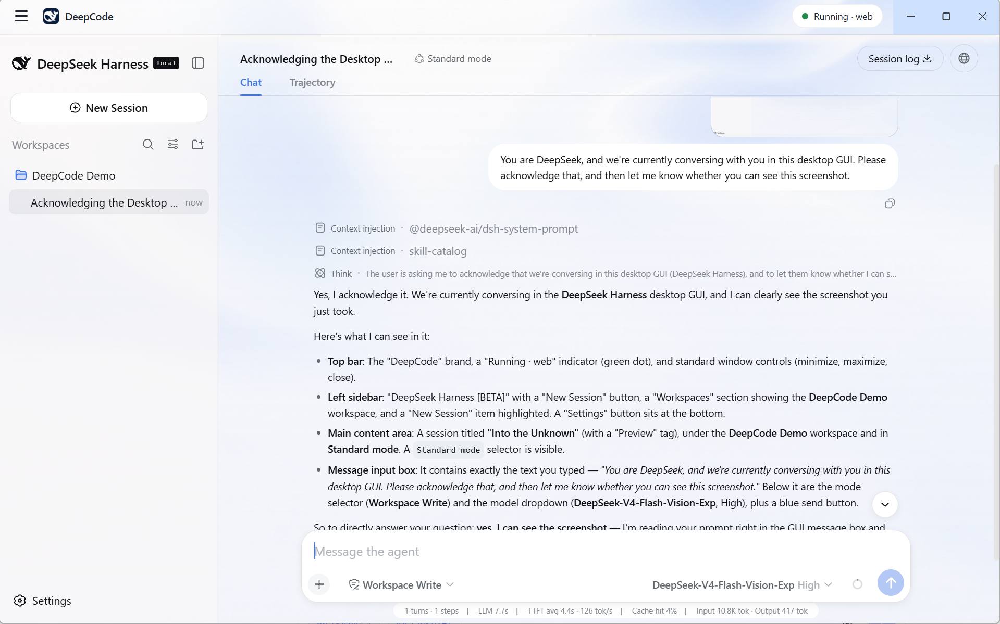
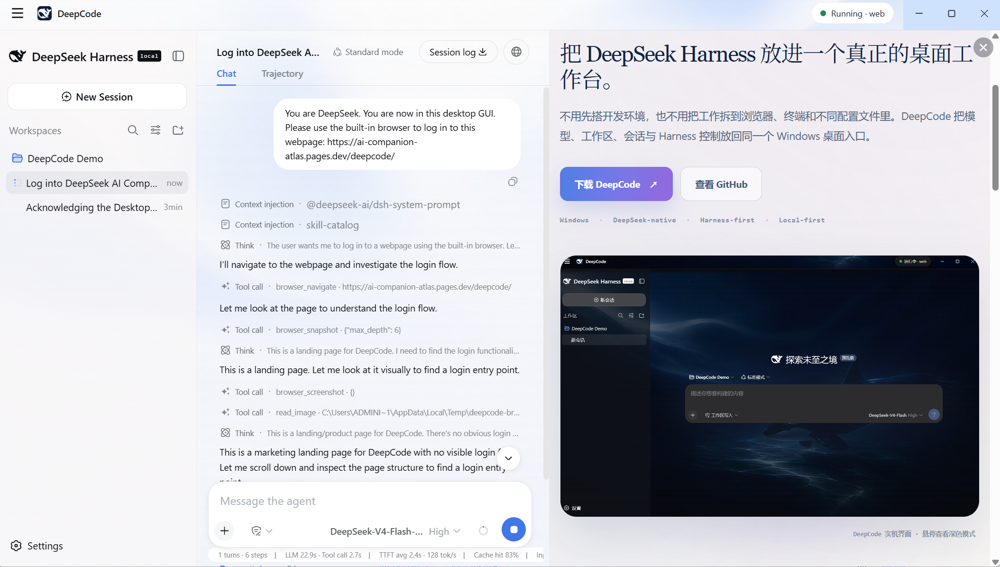
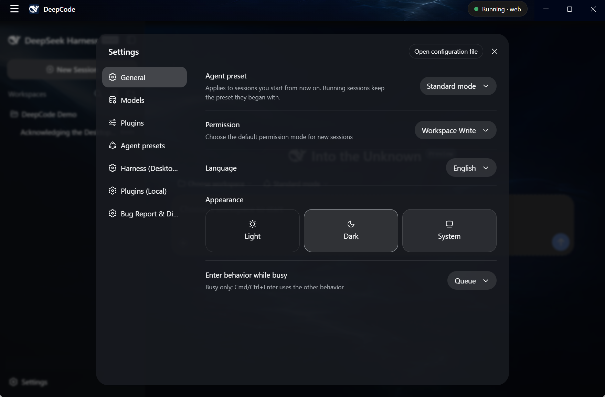

<div align="center">

#  DeepSeekGUI

</div>

<div align="right">

English | [中文](README.zh.md)

</div>

<p align="center">
  <em>Use it like Codex. Inspect it like a lab. Extend it like Harness.</em>
</p>

<p align="center">
  A DeepSeek-native Agent Workbench for Windows, powered by DeepSeek Harness.
</p>

<p align="center">
  <a href="https://github.com/See-Sol-Lab/DeepSeekGUI/releases/latest"></a>
  <a href="https://github.com/See-Sol-Lab/DeepSeekGUI/releases"></a>
  
  <a href="DEEPSEEKGUI-LICENSE.md"></a>
</p>

<!-- PRODUCT HUNT BADGE SLOT: add the official post badge after the DeepSeekGUI Product Hunt URL exists. -->

DeepSeekGUI turns [DeepSeek Harness](https://github.com/deepseek-ai/deepseek-harness) into a complete Windows product: install it, connect DeepSeek, choose a workspace, and let an agent inspect, edit, browse, run tools, and explain its work. Harness remains the only runtime and source of session, model, credential, permission, tool, memory, compaction, and plugin state.

**Unofficial product:** DeepSeekGUI is not affiliated with or endorsed by DeepSeek. The upstream Harness runtime and official Web UI are DeepSeek's work.

## Download

| Platform | Download | Requirements |
| --- | --- | --- |
| Windows | [Download the installer](https://github.com/See-Sol-Lab/DeepSeekGUI/releases/download/v1.0.0/DeepSeekGUI-Setup-1.0.0.exe) | Windows 10/11, x64 |

DeepSeekGUI installs for the current Windows user without administrator rights and includes its own Harness runtime, Node.js, and pnpm.

Or download the latest installer and checksum from PowerShell with [GitHub CLI](https://cli.github.com/):

```powershell
gh release download --repo See-Sol-Lab/DeepSeekGUI --pattern 'DeepSeekGUI-Setup-*.exe' --pattern 'SHA256SUMS.txt' --clobber
```

DeepSeekGUI V1 is not code-signed, so Windows SmartScreen may show an unknown-publisher warning. Download [`SHA256SUMS.txt`](https://github.com/See-Sol-Lab/DeepSeekGUI/releases/download/v1.0.0/SHA256SUMS.txt) from the same release and verify the installer before running it:

```powershell
Get-FileHash .\DeepSeekGUI-Setup-1.0.0.exe -Algorithm SHA256
```

Continue only when the printed hash matches the release manifest exactly, then run `Start-Process .\DeepSeekGUI-Setup-1.0.0.exe`. See the [installation and troubleshooting guide](docs/user/deepseekgui/data-troubleshooting.md#windows-smartscreen-blocks-the-installer).

## Quick start

1. Install and launch DeepSeekGUI.
2. Open **Settings → Models** and enter your DeepSeek API key.
3. Select a model. Choose an image-capable model when the task includes screenshots or other visual input.
4. Return to the home page and choose a workspace folder.
5. Start a session and give the agent one concrete outcome.
6. Review tool approvals and the resulting file changes.

The [DeepSeekGUI quick-start guide](docs/user/deepseekgui/quickstart.md) walks through the complete first session.

## Why DeepSeekGUI

| | |
| --- | --- |
| **Harness-native** | Profiles, sessions, tools, credentials, permissions, memory, compaction, hooks, and plugins stay in the native Harness composition. DeepSeekGUI does not create a second agent runtime. |
| **DeepSeek-first** | DeepSeek models, reasoning, image input, and Harness behavior are first-class product paths rather than compatibility afterthoughts. |
| **A real Windows product** | One-click current-user installation, resident tray, model settings, DSH Terminal, updates, feedback, diagnostics, and an uninstall data choice. |
| **Observable and recoverable** | Live Harness status, explicit targets, redacted diagnostics, last-known-good Profile recovery, and protected plugin changes make failures understandable and reversible. |
| **Safer execution** | Sandbox is the recommended default, approvals remain owned by Harness, Full Access always carries an explicit warning, and browser submissions require approval. |
| **Programmable** | Use arbitrary compatible Harness Profiles and Cordis plugins, inspect the active composition, and keep the official DSH CLI close at hand. |

## Product tour



### Work with code, files, and images

Choose a workspace, resume durable sessions, attach images to a vision-capable model, stream results, and review tool activity without leaving the desktop application.



### Give the agent a real browser

DeepSeekGUI's built-in browser uses visible Microsoft Edge, checks navigation targets and redirects against SSRF rules, keeps physical mouse and keyboard control with the user, and routes sensitive submissions through Harness approval.



### Inspect and control the Harness

Switch Managed or Existing Homes, select Profiles, inspect effective plugin state, manage compatible plugins through the official CLI path, and recover a failed change without hiding what happened.



## What ships in V1

- Windows 10/11 x64 installer and portable unpacked build.
- DeepSeek and custom model configuration through Harness settings.
- Text and image input for models that advertise the corresponding modality.
- Workspace-based coding sessions with native Harness tools and approvals.
- Managed and Existing Harness Homes with Profile discovery and switching.
- Plugin Manager with target confirmation, streamed output, post-checks, and protected recovery.
- Built-in real-browser tools and a visible Browser Panel.
- Sandbox, Full Access, Read-only, and Custom permission reporting.
- DSH Terminal with private runtime shims and no system PATH modification.
- Update verification, local diagnostics export, feedback, system tray, and bilingual Chinese/English desktop copy.

DeepSeekGUI V1 is tested on Windows x64. It is not code-signed and does not ship macOS or Linux builds, an account system, automatic startup, or a plugin marketplace.

## Documentation

| Guide | What it covers |
| --- | --- |
| [Quick start](docs/user/deepseekgui/quickstart.md) | Install, connect DeepSeek, choose a workspace, and finish the first session. |
| [Models and vision](docs/user/deepseekgui/models.md) | API keys, model selection, image input, and custom providers. |
| [Workspaces and sessions](docs/user/deepseekgui/workspaces-sessions.md) | Workspace scope, durable sessions, attachments, review, and tray behavior. |
| [Profiles and plugins](docs/user/deepseekgui/profiles-plugins.md) | Managed/Existing Homes, Profile switching, plugin operations, and recovery. |
| [Permissions and approvals](docs/user/deepseekgui/permissions.md) | Sandbox, Full Access, approvals, Existing Home behavior, and browser permissions. |
| [Desktop tools](docs/user/deepseekgui/desktop-tools.md) | Browser, DSH Terminal, updates, diagnostics, feedback, and lifecycle. |
| [Data and troubleshooting](docs/user/deepseekgui/data-troubleshooting.md) | Data locations, privacy, uninstall behavior, common failures, and support. |

The documentation website also retains the upstream Harness development tutorials and reference material for plugin authors and advanced users.

## Data and privacy

DeepSeekGUI stores its Managed Harness Home under `%APPDATA%\DeepSeekGUI\dsh`. Credentials, settings, sessions, Profiles, and plugins stay in that Home unless the configured model provider or a tool transmits content required by the task.

Service logs redact credential-shaped text. Diagnostics bundles are created locally and never uploaded automatically. Review crash dumps before sharing them because they can still contain local paths or memory fragments.

Uninstall asks whether to remove `%APPDATA%\DeepSeekGUI`. Keeping it preserves credentials, settings, sessions, and Profiles for a later reinstall.

## Build from source

### Run DeepSeekGUI Desktop from source

DeepSeekGUI development requires the Node.js version declared by the repository and pnpm:

```sh
git clone https://github.com/See-Sol-Lab/DeepSeekGUI.git
cd DeepSeekGUI
pnpm install
pnpm run build
pnpm run dev:desktop
```

Build the Windows distribution with:

```sh
pnpm run build:desktop-dist
```

See [DeepSeekGUI Desktop](apps/desktop/README.md) for engineering details and packaging verification.

<a id="run"></a>

### Run Harness from npm

Install Node.js, then start the upstream Web UI with:

```sh
npx @deepseek-ai/dsh web
```

The command opens `http://127.0.0.1:3080` for a local launch.

<a id="run-deepseek-harness-from-source"></a>

### Run Harness from source

The public DeepSeekGUI tree contains the upstream Harness source used by the desktop build:

```sh
pnpm install
pnpm run build
pnpm dsh web
```

## Contributing and support

- Report DeepSeekGUI bugs and product feedback through [DeepSeekGUI Issues](https://github.com/See-Sol-Lab/DeepSeekGUI/issues).
- Read [CONTRIBUTING.md](CONTRIBUTING.md) before sending a pull request.
- Use [DeepSeek Harness Discussions](https://github.com/deepseek-ai/deepseek-harness/discussions) for questions about upstream Harness behavior.

## License and upstream relationship

This repository combines two licensing scopes:

- Upstream DeepSeek Harness code and upstream-derived material remain under DeepSeek's [MIT License](LICENSE-MIT-UPSTREAM).
- Original DeepSeekGUI desktop and product work is source-available under the [PolyForm Perimeter License 1.0.1](apps/desktop/LICENSE). Personal, educational, research, hobby, internal business, and other permitted uses are allowed; providing a competing product requires a separate license from See-Sol-Lab.

The root [`LICENSE`](LICENSE) is a scope notice, not a single repository-wide license grant. Read [DeepSeekGUI licensing](DEEPSEEKGUI-LICENSE.md) and [third-party notices](THIRD_PARTY_NOTICES.md) before redistributing the software.

---

DeepSeekGUI is the public release repository. Day-to-day development happens in a separate private repository; releases publish the product tree rather than the private development history.
