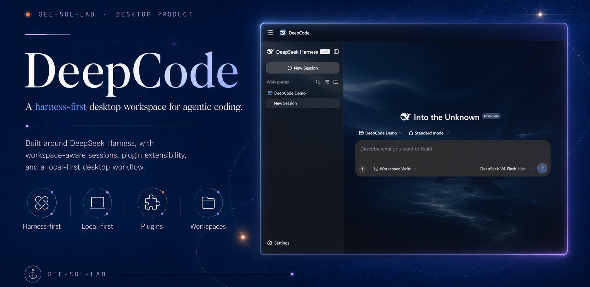
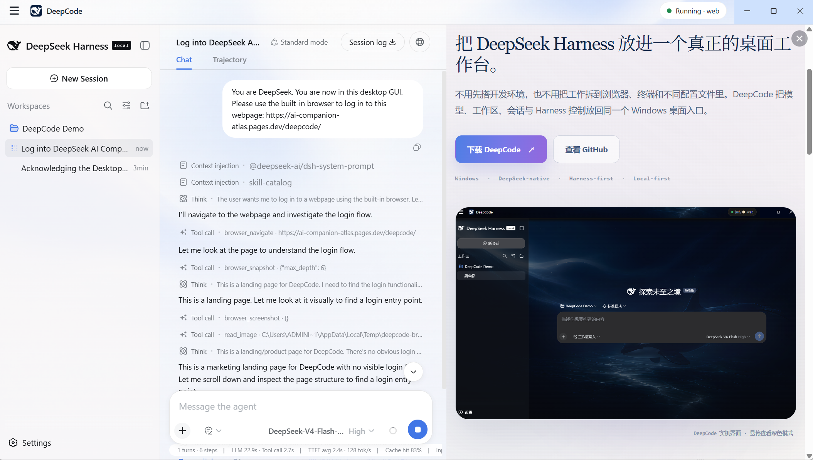
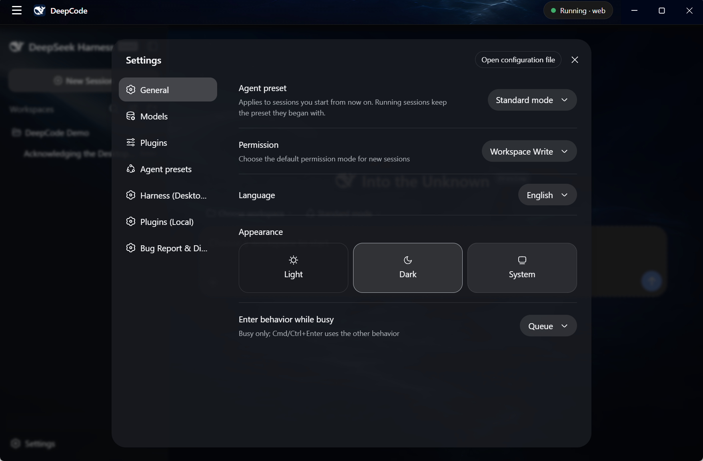

<div align="center">

#  DeepCode

</div>

<div align="right">

[English](README.md) | 中文

</div>

<p align="center">
  <em>像 Codex 一样使用。像实验室一样检查。像 Harness 一样扩展。</em>
</p>

<p align="center">
  由 DeepSeek Harness 驱动的 Windows DeepSeek 原生 Agent Workbench。
</p>

<p align="center">
  <a href="https://github.com/See-Sol-Lab/DeepSeekGUI/releases/latest"></a>
  <a href="https://github.com/See-Sol-Lab/DeepSeekGUI/releases"></a>
  
  <a href="DEEPCODE-LICENSE.md"></a>
</p>

<!-- PRODUCT HUNT BADGE SLOT: DeepCode Product Hunt URL 创建后添加官方 post badge。 -->

DeepCode 把 [DeepSeek Harness](https://github.com/deepseek-ai/deepseek-harness) 变成完整的 Windows 产品：安装应用、连接 DeepSeek、选择工作区，然后让 agent 检查、编辑、浏览、运行工具并解释自己的工作。Harness 仍是会话、模型、凭据、权限、工具、记忆、压缩与插件状态的唯一运行时和真源。

**非官方产品：** DeepCode 与 DeepSeek 无隶属关系，也未获其背书。上游 Harness 运行时与官方 Web UI 是 DeepSeek 的工作成果。

## 下载

| 平台 | 下载 | 要求 |
| --- | --- | --- |
| Windows | [下载安装包](https://github.com/See-Sol-Lab/DeepSeekGUI/releases/download/v1.0.0/DeepCode-Setup-1.0.0.exe) | Windows 10/11，x64 |

DeepCode 为当前 Windows 用户安装，不需要管理员权限，并自带 Harness 运行时、Node.js 与 pnpm。

或在已安装 [GitHub CLI](https://cli.github.com/) 的 PowerShell 中下载最新安装包与校验清单：

```powershell
gh release download --repo See-Sol-Lab/DeepSeekGUI --pattern 'DeepCode-Setup-*.exe' --pattern 'SHA256SUMS.txt' --clobber
```

DeepCode V1 尚未进行代码签名，因此 Windows SmartScreen 可能显示未知发布者警告。请从同一个 Release 下载 [`SHA256SUMS.txt`](https://github.com/See-Sol-Lab/DeepSeekGUI/releases/download/v1.0.0/SHA256SUMS.txt)，并在运行前校验安装包：

```powershell
Get-FileHash .\DeepCode-Setup-1.0.0.exe -Algorithm SHA256
```

只有输出的 hash 与发布清单完全一致时才继续，然后运行 `Start-Process .\DeepCode-Setup-1.0.0.exe` 完成安装。详见[安装与故障排查指南](docs/user/deepcode/data-troubleshooting.zh.md#windows-smartscreen-blocks-the-installer)。

## 快速开始

1. 安装并启动 DeepCode。
2. 打开**设置 → 模型**，输入 DeepSeek API key。
3. 选择模型。任务包含截图或其他视觉输入时，请选择支持图片的模型。
4. 返回首页并选择工作区文件夹。
5. 新建会话，向 agent 说明一个具体结果。
6. 检查工具批准请求与最终文件改动。

[DeepCode 快速开始指南](docs/user/deepcode/quickstart.zh.md)会带你完成完整的第一次会话。

## 为什么选择 DeepCode

| | |
| --- | --- |
| **Harness 原生** | Profile、会话、工具、凭据、权限、记忆、压缩、钩子与插件全部保留在 Harness 原生组合中。DeepCode 不建立第二套 agent 运行时。 |
| **DeepSeek 优先** | DeepSeek 模型、推理、图片输入与 Harness 行为都是第一等产品路径，不是事后补上的兼容层。 |
| **真正的 Windows 产品** | 一键当前用户安装、常驻托盘、模型设置、DSH Terminal、更新、反馈、诊断与卸载数据选择。 |
| **可观察、可恢复** | 实时 Harness 状态、明确操作目标、已脱敏诊断、last-known-good Profile 恢复与受保护的插件改动，让失败可以理解并恢复。 |
| **更安全的执行** | Sandbox 是推荐默认值，批准仍由 Harness 持有，Full Access 始终显示明确警告，浏览器提交必须要求批准。 |
| **可编程** | 使用任意兼容的 Harness Profile 与 Cordis 插件，检查当前组合，并随时使用官方 DSH CLI。 |

## 产品一览


### 使用代码、文件与图片工作

选择工作区、恢复持久化会话、向视觉模型附加图片、流式查看结果，并在桌面应用中检查工具活动。


### 给 agent 一个真实浏览器

DeepCode 内置浏览器使用可见的 Microsoft Edge，按 SSRF 规则检查导航与重定向，把物理鼠标与键盘控制留给用户，并通过 Harness 批准处理敏感提交。



### 检查并控制 Harness

切换 Managed Home 或 Existing Home、选择 Profile、检查插件 effective status、通过官方 CLI 路径管理兼容插件，并在不掩盖事实的前提下恢复失败改动。



## V1 包含什么

- Windows 10/11 x64 安装包与 portable unpacked build。
- 通过 Harness 设置配置 DeepSeek 与自定义模型。
- 为声明对应模态的模型提供文本与图片输入。
- 基于工作区的 coding 会话，以及原生 Harness 工具与批准。
- Managed Home 与 Existing Home，以及 Profile 发现和切换。
- Plugin Manager，包括目标确认、流式输出、事后检查与受保护恢复。
- 内置真实浏览器工具与可见 Browser Panel。
- Sandbox、Full Access、Read-only 与 Custom 权限状态。
- DSH Terminal，包括私有运行时 shim，绝不修改系统 PATH。
- 更新校验、本地诊断导出、反馈、系统托盘与完整中英双语桌面文案。

DeepCode V1 仅在 Windows x64 上测试。它尚未进行代码签名，也不提供 macOS 或 Linux 构建、账户系统、开机自启动或插件市场。

## 文档

| 指南 | 内容 |
| --- | --- |
| [快速开始](docs/user/deepcode/quickstart.zh.md) | 安装、连接 DeepSeek、选择工作区并完成第一次会话。 |
| [模型与视觉](docs/user/deepcode/models.zh.md) | API key、模型选择、图片输入与自定义提供方。 |
| [工作区与会话](docs/user/deepcode/workspaces-sessions.zh.md) | 工作区范围、持久化会话、附件、检查与托盘行为。 |
| [Profile 与插件](docs/user/deepcode/profiles-plugins.zh.md) | Managed/Existing Home、Profile 切换、插件操作与恢复。 |
| [权限与批准](docs/user/deepcode/permissions.zh.md) | Sandbox、Full Access、批准、Existing Home 行为与浏览器权限。 |
| [桌面工具](docs/user/deepcode/desktop-tools.zh.md) | 浏览器、DSH Terminal、更新、诊断、反馈与生命周期。 |
| [数据与故障排查](docs/user/deepcode/data-troubleshooting.zh.md) | 数据位置、隐私、卸载行为、常见失败与支持。 |

文档网站同时保留上游 Harness 开发教程与参考资料，供插件作者与高级用户使用。

## 数据与隐私

DeepCode 把 Managed Harness Home 保存在 `%APPDATA%\DeepCode\dsh`。凭据、设置、会话、Profile 与插件会留在该 Home 中；已配置的模型提供方或工具仍可能发送任务要求的内容。

服务日志会脱敏凭据形态文本。诊断包保存在本地，绝不自动上传。Crash dump 仍可能包含本地路径或内存片段，分享前必须检查。

卸载时，DeepCode 会询问是否删除 `%APPDATA%\DeepCode`。保留该目录，即可在以后重新安装时继续使用凭据、设置、会话与 Profile。

## 从源码构建

### 从源码运行 DeepCode Desktop

DeepCode 开发需要仓库声明的 Node.js 版本与 pnpm：

```sh
git clone https://github.com/See-Sol-Lab/DeepSeekGUI.git
cd DeepCode
pnpm install
pnpm run build
pnpm run dev:desktop
```

构建 Windows 发行版：

```sh
pnpm run build:desktop-dist
```

工程细节与打包验证见 [DeepCode Desktop](apps/desktop/README.zh.md)。

<a id="run"></a>

### 通过 npm 运行 Harness

安装 Node.js，然后启动上游 Web UI：

```sh
npx @deepseek-ai/dsh web
```

该命令在本机启动时会打开 `http://127.0.0.1:3080`。

<a id="run-deepseek-harness-from-source"></a>

### 从源码运行 Harness

DeepCode 公开代码树包含桌面构建所使用的上游 Harness 源码：

```sh
pnpm install
pnpm run build
pnpm dsh web
```

## 参与贡献与支持

- 通过 [DeepCode Issues](https://github.com/See-Sol-Lab/DeepSeekGUI/issues) 报告 DeepCode bug 与产品反馈。
- 提交 PR 前请阅读 [CONTRIBUTING.md](CONTRIBUTING.zh.md)。
- 上游 Harness 行为问题请使用 [DeepSeek Harness Discussions](https://github.com/deepseek-ai/deepseek-harness/discussions)。

## 许可证与上游关系

本仓库包含两类许可证范围：

- 上游 DeepSeek Harness 代码及其衍生内容继续遵循 DeepSeek 的 [MIT License](LICENSE-MIT-UPSTREAM)。
- DeepCode 原创桌面与产品代码以 [PolyForm Perimeter License 1.0.1](apps/desktop/LICENSE) 源码可见发布。个人、教育、研究、兴趣、公司内部使用及其他许可范围内的用途都可以；提供竞争产品需要获得 See-Sol-Lab 的单独授权。

根目录 [`LICENSE`](LICENSE) 是适用范围说明，不是覆盖整个仓库的单一许可证授权。重新分发软件前，请阅读 [DeepCode 许可说明](DEEPCODE-LICENSE.md)与[第三方声明](THIRD_PARTY_NOTICES.md)。

---

DeepCode 是公开发布仓库。日常开发在另一个私有仓库中进行；Release 发布产品代码树，不公开私有开发历史。
