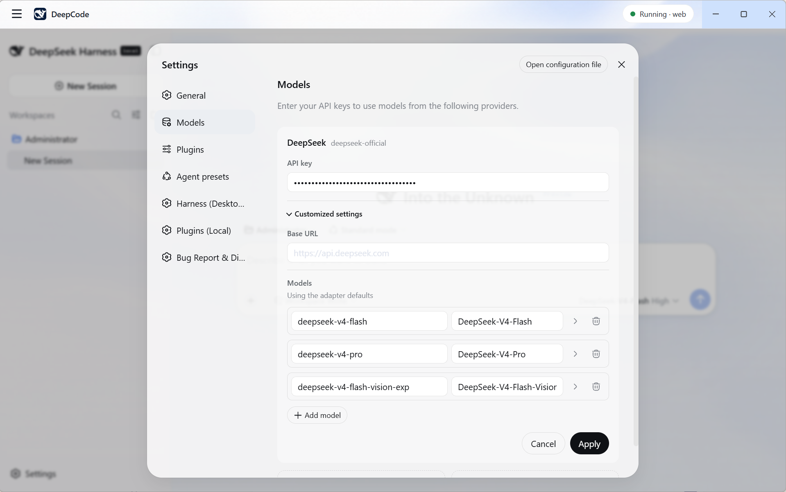

# DeepCode 快速开始

[English](quickstart.md) | 中文

本教程帮助 Windows 新用户从下载安装走到可用的 DeepSeek coding agent（编程智能体）会话。DeepCode 自带 Harness 运行时、Node.js 与 pnpm，安装后的应用不需要开发工具链。

## 开始之前

- 一台 Windows 10 或 Windows 11 x64 电脑。
- 一个 DeepSeek API key。
- 一个你愿意让 agent 检查和编辑的文件夹。

## 1. 下载 DeepCode

下载 [`DeepCode-Setup-1.0.0.exe`](https://github.com/See-Sol-Lab/DeepCode/releases/download/v1.0.0/DeepCode-Setup-1.0.0.exe)。

DeepCode V1 尚未进行代码签名。Windows SmartScreen 可能显示未知发布者警告。运行安装包前，请先用对应的 [`SHA256SUMS.txt`](https://github.com/See-Sol-Lab/DeepCode/releases/download/v1.0.0/SHA256SUMS.txt) 校验文件：

```powershell
Get-FileHash .\DeepCode-Setup-1.0.0.exe -Algorithm SHA256
```

输出的 hash 与发布清单完全一致时再继续。在 SmartScreen 中选择**更多信息**，然后选择**仍要运行**。

## 2. 安装并启动

运行安装包。DeepCode 会为当前 Windows 用户安装，不需要管理员权限；安装过程会创建开始菜单和桌面快捷方式，并在结束后启动 DeepCode。

关闭主窗口只会把 DeepCode 隐藏到系统托盘，Harness 会继续运行。需要停止 Harness 并完全退出时，请从菜单或托盘选择**退出 DeepCode**。

## 3. 连接 DeepSeek

1. 从左下角打开**设置**。
2. 打开**模型**。
3. 选择 DeepSeek 提供方并输入 API key。
4. 选择模型，然后返回首页。

DeepCode 通过 Harness 凭据服务把 key 保存在应用数据目录中，不会把 key 写入安装包、命令行或诊断日志。



模型选择、图片输入与自定义提供方见[模型与视觉](models.zh.md)。

## 4. 选择工作区

选择本次任务使用的文件夹。在推荐的 Sandbox 模式下，这个工作区是 agent 可以写入的文件范围。评估不熟悉的自动化时，请从项目副本或已纳入版本控制的目录开始。

## 5. 开始第一个会话

新建会话，并给 agent 一个具体结果，例如：

> 阅读这个项目，解释它如何启动，并找出我最应该先理解的三个文件。暂时不要编辑任何内容。

确认结果符合预期后，再要求 agent 完成边界明确的修改。DeepCode 会流式显示回复，并把会话保存在当前选择的 Harness Home 中，供你稍后恢复。


## 6. 检查批准请求与改动

工具批准由 Harness 提供。批准前请阅读请求执行的具体动作。DeepCode 绝不自动批准操作，也不维护另一份信任缓存。

日常工作请保持 **Sandbox**。只有任务确实需要 Windows 账户级访问，而且你理解界面显示的风险时，才启用 **Full Access**。

## 下一步

- [模型与视觉](models.zh.md)
- [工作区与会话](workspaces-sessions.zh.md)
- [Profile 与插件](profiles-plugins.zh.md)
- [权限与批准](permissions.zh.md)
- [桌面工具](desktop-tools.zh.md)
- [数据与故障排查](data-troubleshooting.zh.md)
